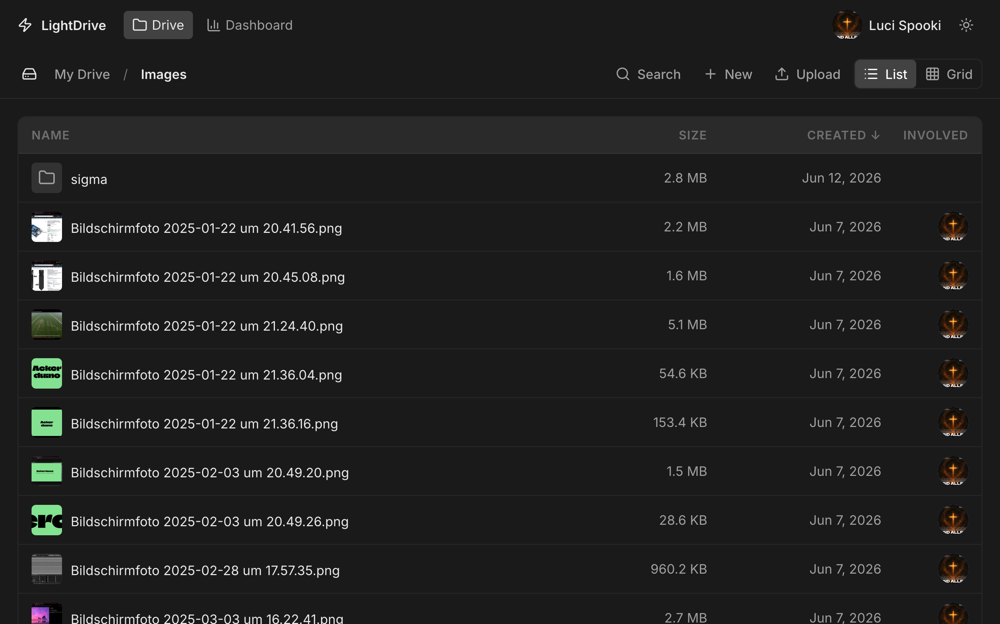

# ⚡ LightDrive

Self-hosted cloud storage with file sharing, previews, analytics, and a REST API.

Built with [SvelteKit](https://kit.svelte.dev/), [Prisma](https://www.prisma.io/), and [FlewUI](https://github.com/lbirkert/FlewUi).

## Quick Install (Linux)

```bash
curl -fsSL https://raw.githubusercontent.com/lbirkert/lightdrive/main/setup.sh | bash
```

Installs Node.js, clones the repo, builds the app, and registers a systemd service.  
Works on Debian, Ubuntu, Fedora, Arch, openSUSE, and Raspberry Pi OS.  
Run the same command again to update.

## Local Development

```bash
git clone https://github.com/lbirkert/lightdrive.git
cd lightdrive
cp .env.example .env
npm install
npm run dev
```

## Features

| | |
|---|---|
| 📁 **File management** | Folder tree, list/grid views, drag-and-drop uploads |
| 🔗 **Share links** | Granular permissions (view, edit, insert, structure) |
| 👥 **Collaboration** | Invite users to folders with role-based access |
| 🖼️ **Previews** | Images, PDFs, documents (docx/md/txt/csv), audio/video |
| 📊 **Analytics** | Storage usage, upload/download activity charts |
| 🔒 **Security** | Argon2 hashing, HTTP-only session cookies |
| 📡 **REST API** | Full API with Scalar documentation at `/api-docs` |

## Screenshots



## Routes

| Path | Description |
|------|-------------|
| `/` | Marketing landing page |
| `/drive/{userId}` | Personal drive |
| `/drive/{shareToken}` | Shared drive (via share link) |
| `/auth` | Sign in / Sign up |
| `/account` | Account settings |
| `/account/preferences` | Theme preferences |
| `/account/shares` | Manage share links |
| `/dashboard` | Usage analytics |
| `/api-docs` | REST API reference |

## Environment

| Variable | Default | Description |
|----------|---------|-------------|
| `DATABASE_URL` | `file:./dev.db` | SQLite database path |
| `ORIGIN` | — | Public URL (required for production) |
| `PORT` | `3000` | Server port |
| `BODY_SIZE_LIMIT` | `52428800` | Max upload size (bytes) |

## Tech Stack

- **Runtime:** Node.js 24
- **Framework:** SvelteKit (Svelte 5)
- **Database:** SQLite via Prisma + libSQL (PostgreSQL optional)
- **Auth:** Argon2 password hashing, HTTP-only session cookies
- **UI:** FlewUI design system
- **Icons:** Lucide
- **Previews:** Sharp (images), Mammoth (docx), Marked (markdown)
- **Transcoding:** FFmpeg (audio/video)
